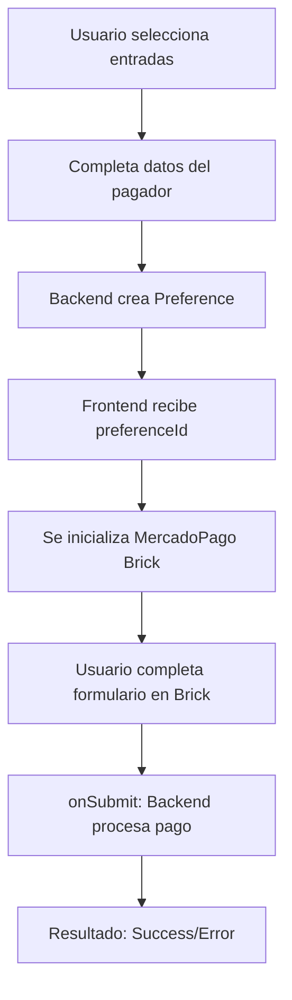

# 🔍 Identificación de Integración MercadoPago: CHECKOUT BRICKS

## 📊 **Análisis Completo de Tu Integración**

Después de examinar tu código frontend y backend, he identificado **exactamente** qué tipo de integración de MercadoPago estás usando.

---

## ✅ **Tipo de Integración: CHECKOUT BRICKS**

### 🎯 **Evidencias Definitivas**

**1. Frontend - Componente Específico:**
```typescript
// recitapp-front/src/app/modules/payment/components/mercadopago-bricks/
MercadoPagoBricksComponent
```

**2. SDK Utilizado:**
```typescript
script.src = 'https://sdk.mercadopago.com/js/v2';
this.mp = new MercadoPago(publicKey);
this.bricks = this.mp.bricks();
```

**3. Tipo de Brick:**
```typescript
this.cardPaymentBrickController = await this.bricks.create('cardPayment', 'cardPaymentBrick_container', settings);
```

**4. Template HTML:**
```html
<div id=\"cardPaymentBrick_container\"></div>
<app-mercadopago-bricks [paymentData]=\"paymentData\"></app-mercadopago-bricks>
```

---

## 🔧 **Configuración Técnica Identificada**

### **Backend (Java/Spring Boot)**
- ✅ **API de Preferences** para crear preferencias de pago
- ✅ **Configuración unificada** (sin `purpose: \"wallet_purchase\"`)
- ✅ **Métodos de pago explícitos** configurados
- ✅ **URLs de redirect** configuradas

### **Frontend (Angular)**
- ✅ **SDK v2 de MercadoPago** cargado dinámicamente
- ✅ **Card Payment Brick** implementado
- ✅ **Configuración de métodos de pago** en el brick
- ✅ **Manejo de callbacks** (onReady, onSubmit, onError)

---

## 📋 **Características de Tu Integración**

### **✅ LO QUE TIENES (Checkout Bricks)**

| Característica | ✅ Implementado |
|---|---|
| **SDK v2** | ✅ `https://sdk.mercadopago.com/js/v2` |
| **Card Payment Brick** | ✅ `this.bricks.create('cardPayment')` |
| **Configuración de Preferencias** | ✅ Backend Java |
| **Métodos de Pago Configurables** | ✅ En settings del brick |
| **UI Personalizable** | ✅ Themes y estilos |
| **Manejo de Errores** | ✅ Callbacks implementados |
| **Accesibilidad** | ✅ Métodos de accesibilidad |
| **Integración con Backend** | ✅ API REST |

### **❌ LO QUE NO TIENES**

| Tipo | ❌ No Implementado |
|---|---|
| **Checkout Pro** | ❌ No hay redirects a init_point |
| **Checkout API** | ❌ No hay manejo directo de tokens |
| **Web Tokenize Checkout** | ❌ Tecnología legacy |

---

## 🎯 **Flujo de Tu Integración Actual**



---

## 🔍 **Por Qué Solo Aparecen Tarjetas**

**Tu integración está CORRECTA** ✅, pero hay un problema específico con **Checkout Bricks + Testing**:

### **Problema Identificado:**
1. **Checkout Bricks** requiere **process diferente** para testing con wallet
2. **Card Payment Brick** por defecto **prioriza tarjetas**
3. **Usuarios de prueba** necesitan configuración específica
4. **Según documentación oficial** de MercadoPago:

> **\"Para pagos con Mercado Pago Wallet en Checkout Bricks, es importante usar usuarios de prueba con saldo agregado manualmente\"**

---

## ✅ **Solución Específica para Checkout Bricks**

### **1. Configuración Correcta del Brick**
```typescript
// Tu configuración actual está PERFECTA ✅
paymentMethods: {
  creditCard: 'all',
  debitCard: 'all', 
  mercadoPago: 'all' // ✅ Wallet habilitado
}
```

### **2. Testing con Checkout Bricks**
Según documentación oficial, para Checkout Bricks debes:

1. **Crear usuarios de prueba** desde Dashboard
2. **Agregar saldo ficticio** al usuario COMPRADOR
3. **NO usar el email de sesión** en el formulario del brick
4. **Permitir login libre** en el checkout (✅ ya implementado)

### **3. Configuración Backend**
```java
// Tu configuración está PERFECTA ✅
// No hay purpose restrictivo
// Métodos de pago explícitamente configurados
// Payer email opcional (✅ ya implementado)
```

---

## 🎉 **Conclusión**

### **Tu Integración es:**
- ✅ **Checkout Bricks** (Card Payment Brick)
- ✅ **Configuración backend correcta**
- ✅ **SDK v2 implementado correctamente**
- ✅ **Métodos de pago habilitados**

### **El Problema es:**
- ❌ **Proceso de testing incorrecto**
- ❌ **Usuario de prueba sin saldo**
- ❌ **Necesitas seguir guía específica para Bricks**

### **La Solución es:**
- ✅ **Seguir SOLUCION_DEFINITIVA_TESTING_MERCADOPAGO.md**
- ✅ **Crear usuarios de prueba con saldo**
- ✅ **Usar proceso de testing específico para Bricks**

---

## 📚 **Documentación Oficial de Referencia**

- [Checkout Bricks - MercadoPago](https://www.mercadopago.com.ar/developers/es/docs/checkout-bricks)
- [Card Payment Brick](https://www.mercadopago.com.ar/developers/es/docs/checkout-bricks/card-payment-brick)
- [Testing con Bricks](https://www.mercadopago.com.ar/developers/es/docs/checkout-bricks/integration-test)

---

## 🚀 **Próximos Pasos**

1. ✅ **Confirmar**: Tu integración es **Checkout Bricks**
2. ✅ **Seguir**: Guía de testing específica para Bricks
3. ✅ **Crear**: Usuarios de prueba con saldo ficticio
4. ✅ **Probar**: Con el proceso correcto de testing

**Tu código está perfecto - solo necesitas el proceso de testing correcto para Checkout Bricks.** 🎯 